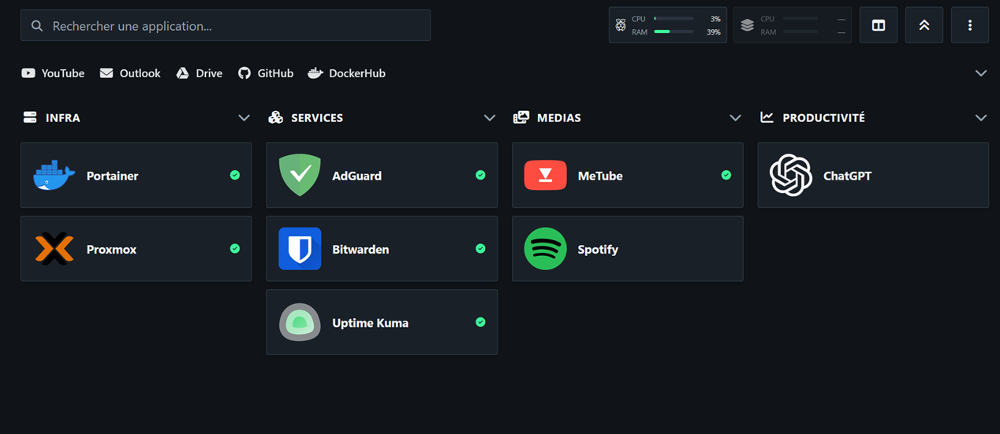

# Dashmon


A lightweight, self-hosted dashboard for your homelab: centralize your services
in one page, keep an eye on their status, and watch the CPU/RAM of your hosts.

- **One page, your whole lab**: services grouped by category or host, search,
  view modes (rows / columns / full), icon or name display.
- **Widget tiles**: live integrations dropped right into each tile — Docker,
  Duplicati, AdGuard, Lichess — see the section below.
- **Status monitoring**: green/red pills for each URL, refreshed automatically.
- **Host metrics**: CPU/RAM widgets from the local host, a tiny Linux agent
  (`/metrics`), or Proxmox with a read-only API token.
- **Themes**: dark & light built-ins, custom themes, import/export, custom CSS.
- **Interface**: English and French, alphabetical or usage-based sorting.
- **Usage-based sorting**: how often you actually open each service.

Node.js / Express server, native ES modules, zero dependency besides Express.
Runs anywhere Docker runs (amd64 & arm64).

## Widget tiles — the heart of Dashmon

Beyond a plain up/down pill, each service tile can host a small **widget**: a
live integration that talks directly to the tool it represents. This is the
real added value of Dashmon — one glance at the dashboard tells you what is
actually going on.

| Widget | What it shows |
| --- | --- |
| **Docker** | containers running / total + images up to date (MAJ), each image cross-checked against its registry via digest comparison; connect through the local socket or a remote Docker API (TCP) |
| **Duplicati** | last backup OK / NOK with date & time |
| **AdGuard** | queries blocked as a percentage |
| **Lichess** | your current rating (ELO) and its recent delta |
| **YouTube** | subscriber count of a channel, read from its public page (no API key) |
| **Docker Hub** | pull count of a repository, plus its stars and last push |
| **GitHub** | stars, forks, open issues or watchers of a repository |

A service with **no** widget is a plain link: it is probed like before, with its
green/red dot. Pick one of the widgets above in the service editor to turn that
same link into a metric — YouTube, Docker Hub and GitHub measure a *third-party*
site, so a quota or a rate limit turns the tile neutral instead of red, while the
link itself is still down-checked.

New widgets are already on the roadmap, and more will keep coming. **If a tool
you self-host is missing, don't hesitate to propose it** — open an issue (or a
pull request) and it's a strong candidate for the next integration.

### Writing a widget

Widgets are **plugins**: one folder in `widgets/`, three files, no build step, no
npm dependency. Dashmon discovers them at startup, generates their settings form
from their manifest, and serves their renderer to the browser. Adding one touches
**no file of the core** — not the server, not the renderer, not the editor. A
widget can also take over a *category* of service instead of being picked by the
user: `defaultFor: "link"` is how every plain web link is probed.

```bash
cp -r widgets/_template widgets/my-widget   # then edit manifest.json, server.js, client.mjs
```

A broken plugin is skipped with a log line: it can never prevent Dashmon from
starting. Secrets stay server-side and are encrypted in `config.json`.

→ **[docs/EXTENDING.md](docs/EXTENDING.md)** — full guide (manifest, contexts,
security rules, tests).

<p align="center">
  
</p>

## Quick start

### Docker (recommended)

```bash
docker run -d --name dashmon -p 8080:8080 \
  -v dashmon-data:/app/data \
  supersouris7/dashmon
```

→ http://localhost:8080

### Docker Compose

```bash
cp .env.example .env
docker compose up -d
```

Full walkthrough, environment variables, nginx example and troubleshooting:
[deploy/DEPLOYMENT.md](deploy/DEPLOYMENT.md).

### From source

```bash
npm install
npm start
```

Maintainers: see [deploy/MAINTAINER.md](deploy/MAINTAINER.md) for building and
publishing Docker images.

## First steps

1. Open the dashboard, click **Edit Dashmon** to add your own services
   (name, URL, icon, category, host).
2. Turn on **Status monitoring** on the services you want pills for.
3. Add hosts to monitor CPU/RAM (`local`, Linux `/metrics` or Proxmox).
4. Customize the theme and interface language in **Appearance**.

Config, icons and themes are persisted in `dashmon-data` (`/app/data`) —
backup that volume and you're done. `config.json` only contains public sample
data; all API tokens are referenced by environment variable, see `.env.example`.
For Proxmox you may instead paste the token ID/secret directly in the host
editor — the value is then stored in `config.json` (keep your data volume
private).

Full customization guide (create your own themes, import icons):
[CUSTOMIZATION.md](CUSTOMIZATION.md).

> Monitoring URLs that use LAN names (e.g. `service.lan`): Docker's DNS does
> not know your LAN DNS by default. Give the container your resolver or hosts —
> see the [DNS section](deploy/DEPLOYMENT.md#6-monitoring-lan-domains-lan-local).

## Icons

Dashmon uses [Font Awesome 6 (Free)](https://cdnjs.cloudflare.com/ajax/libs/font-awesome/6.7.2/css/all.min.css)
for service and category icons. Pick any free solid/brand class, e.g.
`fa-solid fa-folder`. Requests for additional icons — within the free set — are
welcome.

You can also upload your own **PNG icons** (editor → **Images** tab) and assign
them to a service. Personally, I grab mine from the
[homer-icons](https://github.com/NX211/homer-icons) collection — a great source
of plain, self-hosted app logos.

## Requests, bugs, ideas

Everything goes through the issue tracker:

- **Bug reports**: what you did, what you expected, what happened, docker
  version, how it's deployed, and anything from `docker logs dashmon`.
- **Icon requests**: the exact Font Awesome 6 free class you'd like per service.
- **Feature ideas / ideas**: describe the use case, not just the feature.

## Support & contact

Dashmon is a homelab side-project, developed and released in good faith — not a
commercial product. **There is no SLA, no guaranteed fixes and no paid support.**

- Prefer GitHub issues for bugs and features (publicly answerable, includes the
  picture gallery above).
- For one-off questions, use GitHub Discussions.

## License

MIT — see [LICENSE](LICENSE). Provided “as is”, without warranty of any kind.
You are free to use, modify and redistribute it, including for commercial
purposes, provided you keep the copyright notice.

---

If you use Dashmon and would like to support its development:

<p align="center">
  <a href="https://ko-fi.com/dashmon">♥ Support the project on Ko-fi</a>
</p>