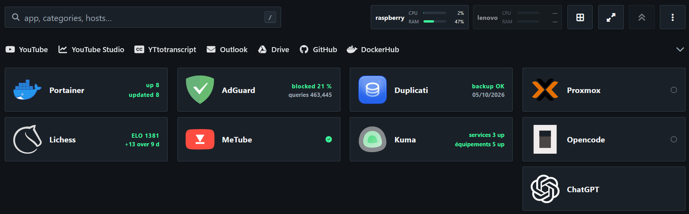

# Dashmon


<p align="center">
  
</p>

**Your whole homelab on a single screen.** Dashmon lists every service you run,
shows at a glance whether it is up, and — for the tools you actually care about —
puts a **live metric right on the tile**: your running containers, your last
backup, your blocked queries, your current rating.

No account, no cloud, no database. One small Node.js container, one page, and
you stop guessing whether *that* thing is working.

- **One page, your whole lab** — group by category or by host, search, three view
  modes (rows / columns / full), icons or names.
- **Live widgets, not just green/red dots** — Docker, Duplicati, AdGuard, Lichess,
  YouTube, Docker Hub, GitHub, Uptime Kuma and Ping report straight onto the tile.
  → [widget catalog](docs/WIDGETS.md)
- **Real status monitoring** — an up/down pill per URL, refreshed automatically.
- **Host metrics** — CPU and RAM from the local machine, a tiny Linux agent
  (`/metrics`), or Proxmox with a read-only API token.
- **Themes** — dark and light built in, plus your own custom themes and CSS.
- **Two languages** — English and French, throughout the interface.
- **Learns your habits** — services you open often float to the top.

Node.js / Express, native ES modules, a single dependency. Runs anywhere Docker
runs, on **amd64 and arm64**.

---

## Widgets — the part you'll actually look at

Most dashboards stop at "this service answers 200 OK". Dashmon goes one step
further: pick a **widget** for a service and the tile starts showing the number
you were about to open a second tab for anyway.

| | |
| --- | --- |
| **Docker** | Running containers, and which images are out of date — each image is compared against its registry **by digest**, so `latest` that quietly changed is flagged. |
| **Duplicati** | Did the last backup succeed, and when? |
| **AdGuard** | Share of DNS queries your blocker filtered out. |
| **Lichess** | Your ELO rating and how it moved over the past month. |
| **YouTube** | Subscriber count of a channel, read from the public page — no API key. |
| **Docker Hub** | Pull count, stars and last push of a repository. |
| **GitHub** | Stars, forks, open issues or watchers — whichever you want to track. |
| **Uptime Kuma** | One line per status page, green while everything is up, red as soon as one monitor is down. |
| **Ping** | Whether an IP or a host answers — the familiar dot, no extra line. |

A service with **no** widget stays a plain link, probed as usual with its green
or red dot. Widgets that measure a *third-party* site (YouTube, Docker Hub,
GitHub) degrade to a neutral tile on quota or rate-limit errors instead of
faking an outage.

**→ [docs/WIDGETS.md](docs/WIDGETS.md) — the full catalog: what each widget
displays, how to configure it, and which secrets it needs.**

Missing a tool you self-host? [Open an issue](https://github.com/supersouris7/dashmon/issues)
— a request for an integration is a strong candidate for the next widget.

## Quick start

### Docker (recommended)

```bash
docker run -d --name dashmon -p 8080:8080 \
  -v dashmon-data:/app/data \
  supersouris7/dashmon
```

→ http://localhost:8080

### Docker Compose

```bash
cp .env.example .env
docker compose up -d
```

Full walkthrough, environment variables, nginx example and troubleshooting:
[deploy/DEPLOYMENT.md](deploy/DEPLOYMENT.md).

### From source

```bash
npm install
npm start
```

Maintainers: see [deploy/MAINTAINER.md](deploy/MAINTAINER.md) for building and
publishing Docker images.

## First steps

1. Click **Edit Dashmon** and add your services (name, URL, icon, category, host).
2. Turn on **Status monitoring** for the services you want a pill on.
3. Give a service a **widget** — that's where the live numbers appear.
4. Add hosts to monitor CPU and RAM (`local`, a Linux `/metrics` agent, or Proxmox).
5. Adjust the theme and language under **Appearance**.

Config, icons and themes live in the `dashmon-data` volume (`/app/data`) — back
that volume up and you're done. The bundled `config.json` contains sample data
only; API tokens are referenced by environment variable, see `.env.example`.
(For Proxmox you may instead paste the token ID and secret directly in the host
editor — that value is then stored in `config.json`, so keep the volume private.)

### What lives where

- **On the server (`config.json`)** — your dashboard: services, categories, hosts,
  web links, language, theme, favicon, click counters.
- **In this browser only (`localStorage`)** — the layout: view mode, sort,
  grouping, how links open, collapsed sections, small icons. Nothing is written
  to disk and nothing is sent back, so **a layout never travels from one device to
  another**. The values already in `config.json` only seed a browser that has
  never picked a layout.

## Icons

Dashmon uses [Font Awesome 6 (Free)](https://cdnjs.cloudflare.com/ajax/libs/font-awesome/6.7.2/css/all.min.css)
for service and category icons — pick any free solid or brand class, e.g.
`fa-solid fa-folder`. Requests for additional icons, within the free set, are
welcome.

You can also upload your own **PNG icons** (editor → **Images** tab) and assign
them to a service. A good source of plain self-hosted app logos is the
[homer-icons](https://github.com/NX211/homer-icons) collection.

## Documentation

| | |
| --- | --- |
| **[docs/WIDGETS.md](docs/WIDGETS.md)** | Every widget: what it shows, how to set it up. |
| **[deploy/DEPLOYMENT.md](deploy/DEPLOYMENT.md)** | Install, environment variables, reverse proxy, troubleshooting. |
| **[CUSTOMIZATION.md](CUSTOMIZATION.md)** | Create your own themes, manage icons. |
| **[docs/EXTENDING.md](docs/EXTENDING.md)** | Write a new widget (developer guide). |

> Monitoring URLs that use LAN names such as `service.lan`? Docker's resolver does
> not know your LAN DNS out of the box. Give the container your resolver or hosts —
> see the [DNS section](deploy/DEPLOYMENT.md#6-monitoring-lan-domains-lan-local).

## Requests, bugs, ideas

Everything goes through the issue tracker:

- **Bug reports** — what you did, what you expected, what happened, the Docker
  version, how you deployed it, and anything relevant from `docker logs dashmon`.
- **Icon requests** — the exact Font Awesome 6 free class you'd like per service.
- **Feature ideas** — describe the use case, not just the feature.

## Support & contact

Dashmon is a homelab side-project, developed and released in good faith — not a
commercial product. **There is no SLA, no guaranteed fix window and no paid
support.**

- Prefer GitHub issues for bugs and features: they stay publicly answerable.
- For one-off questions, use GitHub Discussions.

## License

MIT — see [LICENSE](LICENSE). Provided “as is”, without warranty of any kind. You
are free to use, modify and redistribute it, including commercially, provided you
keep the copyright notice.

---

If Dashmon is useful to you and you'd like to support its development:

<p align="center">
  <a href="https://ko-fi.com/dashmon">♥ Support the project on Ko-fi</a>
</p>
